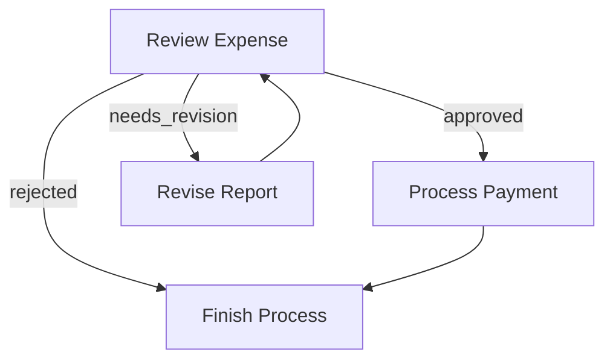
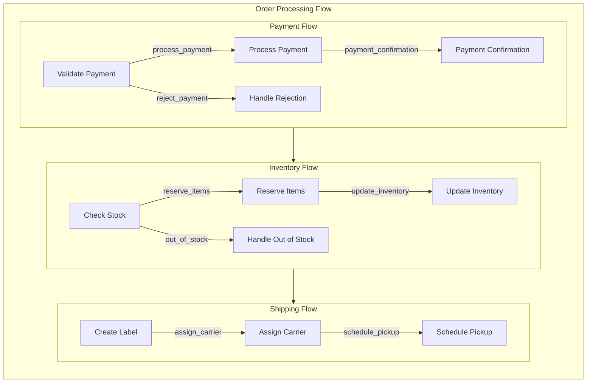
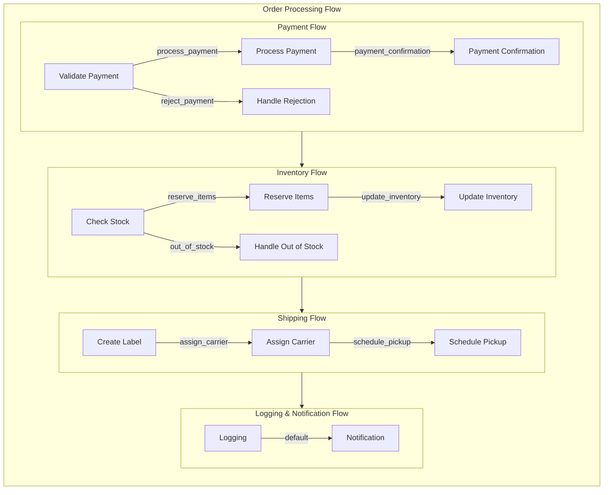

# Flow

A **Flow** orchestrates how Nodes connect and run, based on **Actions** returned from each Node's `postAsync()` method. You can chain Nodes in a sequence or create branching logic depending on the **Action** string.

## 1. Action-based Transitions

Each Node's `postAsync(shared, prepResult, execResult)` method returns an **Action** string. By default, if `postAsync()` doesn't explicitly return anything, we treat that as `"default"`.

You define transitions with the syntax:

1. **Basic default transition:** `nodeA >> nodeB`  
   This means if `nodeA.postAsync()` returns `"default"` (or `undefined`), proceed to `nodeB`.  
   *(Equivalent to `nodeA - "default" >> nodeB`)*

2. **Named action transition:** `nodeA - "actionName" >> nodeB`  
   This means if `nodeA.postAsync()` returns `"actionName"`, proceed to `nodeB`.

It's possible to create loops, branching, or multi-step flows.

## 2. Creating a Flow

A **Flow** begins with a **start** node (or another Flow). You create it using `new Flow(startNode)` to specify the entry point. When you call `flow.runAsync(sharedState)`, it executes the first node, looks at its `postAsync()` return Action, follows the corresponding transition, and continues until there's no next node or you explicitly stop.

### Example: Simple Sequence

Here's a minimal flow of two nodes in a chain:

```typescript
import { BaseNode, Flow, DEFAULT_ACTION } from "../src/pocket";

// Define NodeA
class NodeA extends BaseNode {
  public async prepAsync(sharedState: any): Promise<void> {
    // Preparation logic for NodeA
  }

  public async execAsync(_: void): Promise<void> {
    // Execution logic for NodeA
  }

  public async postAsync(sharedState: any, _: void, __: void): Promise<string> {
    // Transition to NodeB
    return "default";
  }
}

// Define NodeB
class NodeB extends BaseNode {
  public async prepAsync(sharedState: any): Promise<void> {
    // Preparation logic for NodeB
  }

  public async execAsync(_: void): Promise<void> {
    // Execution logic for NodeB
  }

  public async postAsync(sharedState: any, _: void, __: void): Promise<string> {
    // No further nodes to transition to
    return DEFAULT_ACTION;
  }
}

// Instantiate nodes
const nodeA = new NodeA();
const nodeB = new NodeB();

// Define the flow connections
nodeA.addSuccessor(nodeB, "default");

// Create the flow starting with nodeA
const flow = new Flow(nodeA);

// Initial shared state
const sharedState = {};

// Run the flow
flow.runAsync(sharedState).then(() => {
  console.log("Flow completed successfully.");
}).catch(error => {
  console.error("Flow execution failed:", error);
});
```

- When you run the flow, it executes `NodeA`.
- Suppose `NodeA.postAsync()` returns `"default"`.
- The flow then sees the `"default"` Action is linked to `NodeB` and runs `NodeB`.
- If `NodeB.postAsync()` returns `"default"` but we didn't define `NodeB >> somethingElse`, the flow ends there.

### Example: Branching & Looping

Here's a simple expense approval flow that demonstrates branching and looping. The `ReviewExpenseNode` can return three possible Actions:

- `"approved"`: Expense is approved, move to payment processing.
- `"needs_revision"`: Expense needs changes, send back for revision.
- `"rejected"`: Expense is denied, finish the process.

We can wire them like this:

```typescript
import { BaseNode, Flow, DEFAULT_ACTION } from "../src/pocket";

// Define ReviewExpenseNode
class ReviewExpenseNode extends BaseNode {
  public async prepAsync(sharedState: any): Promise<void> {
    // Prepare expense data
  }

  public async execAsync(_: void): Promise<void> {
    // Execute review logic
  }

  public async postAsync(sharedState: any, prepResult: void, execResult: void): Promise<string> {
    // Example decision logic
    const decision = "approved"; // Replace with actual decision-making
    return decision;
  }
}

// Define PaymentNode
class PaymentNode extends BaseNode {
  public async prepAsync(sharedState: any): Promise<void> {
    // Prepare payment data
  }

  public async execAsync(_: void): Promise<void> {
    // Execute payment processing
  }

  public async postAsync(sharedState: any, prepResult: void, execResult: void): Promise<string> {
    return DEFAULT_ACTION;
  }
}

// Define ReviseExpenseNode
class ReviseExpenseNode extends BaseNode {
  public async prepAsync(sharedState: any): Promise<void> {
    // Prepare revision data
  }

  public async execAsync(_: void): Promise<void> {
    // Execute revision logic
  }

  public async postAsync(sharedState: any, prepResult: void, execResult: void): Promise<string> {
    return "needs_revision";
  }
}

// Define FinishNode
class FinishNode extends BaseNode {
  public async prepAsync(sharedState: any): Promise<void> {
    // Prepare finish data
  }

  public async execAsync(_: void): Promise<void> {
    // Execute finish logic
  }

  public async postAsync(sharedState: any, prepResult: void, execResult: void): Promise<string> {
    return DEFAULT_ACTION;
  }
}

// Instantiate nodes
const reviewExpense = new ReviewExpenseNode();
const payment = new PaymentNode();
const reviseExpense = new ReviseExpenseNode();
const finish = new FinishNode();

// Define the flow connections
reviewExpense.addSuccessor(payment, "approved");
reviewExpense.addSuccessor(reviseExpense, "needs_revision");
reviewExpense.addSuccessor(finish, "rejected");

reviseExpense.addSuccessor(reviewExpense, "needs_revision"); // Loop back for revision
payment.addSuccessor(finish, "default"); // Proceed to finish after payment

// Create the flow starting with reviewExpense
const expenseFlow = new Flow(reviewExpense);

// Initial shared state
const sharedState = {};

// Run the flow
expenseFlow.runAsync(sharedState).then(() => {
  console.log("Expense flow completed successfully.");
}).catch(error => {
  console.error("Expense flow execution failed:", error);
});
```

### Flow Diagram



### Running Individual Nodes vs. Running a Flow

- **`node.runAsync(sharedState)`**:  
  Just runs that node alone (calls `prepAsync()`, `execAsync()`, `postAsync()`), and returns an Action.  
  *Use this for debugging or testing a single node.*

- **`flow.runAsync(sharedState)`**:  
  Executes from the start node, follows Actions to the next node, and so on until the flow can't continue (no next node or no next Action).  
  *Use this in production to ensure the full pipeline runs correctly.*

> **Warning:**  
> `node.runAsync(sharedState)` **does not** proceed automatically to the successor and may use incorrect parameters.  
> Always use `flow.runAsync(sharedState)` in production.

## 3. Nested Flows

A **Flow** can act like a Node, enabling powerful composition patterns. This means you can:

1. Use a Flow as a Node within another Flow's transitions.
2. Combine multiple smaller Flows into a larger Flow for reuse.
3. Node `params` will be a merging of **all** parents' `params`.

> **Note:** While **Flow** is also a **Node**, it won't run `execAsync()`.  
> It will run `prepAsync()` and `postAsync()` before and after executing the nodes within the Flow.  
> However, `postAsync()` always receives `undefined` for `execResult`, and should instead retrieve the Flow execution results from the shared store.
{: .warning }

### Basic Flow Nesting

Here's how to connect a nested flow to another node:

```typescript
import { BaseNode, Flow, DEFAULT_ACTION } from "../src/pocket";

// Define sub-flow nodes
class NodeA extends BaseNode {
  public async prepAsync(sharedState: any): Promise<void> {
    // Prepare data for NodeA
  }

  public async execAsync(_: void): Promise<void> {
    // Execute NodeA logic
  }

  public async postAsync(sharedState: any, prepResult: void, execResult: void): Promise<string> {
    return "default";
  }
}

class NodeB extends BaseNode {
  public async prepAsync(sharedState: any): Promise<void> {
    // Prepare data for NodeB
  }

  public async execAsync(_: void): Promise<void> {
    // Execute NodeB logic
  }

  public async postAsync(sharedState: any, prepResult: void, execResult: void): Promise<string> {
    return DEFAULT_ACTION;
  }
}

class NodeC extends BaseNode {
  public async prepAsync(sharedState: any): Promise<void> {
    // Prepare data for NodeC
  }

  public async execAsync(_: void): Promise<void> {
    // Execute NodeC logic
  }

  public async postAsync(sharedState: any, prepResult: void, execResult: void): Promise<string> {
    return DEFAULT_ACTION;
  }
}

// Instantiate nodes
const nodeA = new NodeA();
const nodeB = new NodeB();
const nodeC = new NodeC();

// Define the sub-flow: NodeA -> NodeB
const subFlow = new Flow(nodeA);
nodeA.addSuccessor(nodeB, "default");

// Connect the sub-flow to NodeC
subFlow.addSuccessor(nodeC, "default");

// Create the parent flow starting with the sub-flow
const parentFlow = new Flow(subFlow);

// Initial shared state
const sharedState = {};

// Run the parent flow
parentFlow.runAsync(sharedState).then(() => {
  console.log("Parent flow completed successfully.");
}).catch(error => {
  console.error("Parent flow execution failed:", error);
});
```

When `parentFlow.runAsync(sharedState)` executes:

1. It starts the `subFlow`.
2. `subFlow` runs through its nodes (`NodeA` then `NodeB`).
3. After `subFlow` completes, execution continues to `NodeC`.

### Example: Order Processing Pipeline

Here's a practical example that breaks down order processing into nested Flows:

```typescript
import { BaseNode, Flow, DEFAULT_ACTION } from "../src/pocket";

// Payment Processing Nodes
class ValidatePaymentNode extends BaseNode {
  public async prepAsync(sharedState: any): Promise<void> {
    // Validate payment details
  }

  public async execAsync(_: void): Promise<void> {
    // Execute payment validation
  }

  public async postAsync(sharedState: any, _, __: void): Promise<string> {
    // Transition based on validation result
    const isValid = true; // Replace with actual validation logic
    return isValid ? "process_payment" : "reject_payment";
  }
}

class ProcessPaymentNode extends BaseNode {
  public async prepAsync(sharedState: any): Promise<void> {
    // Prepare payment processing
  }

  public async execAsync(_: void): Promise<void> {
    // Execute payment processing
  }

  public async postAsync(sharedState: any, _, __: void): Promise<string> {
    return "payment_confirmation";
  }
}

class PaymentConfirmationNode extends BaseNode {
  public async prepAsync(sharedState: any): Promise<void> {
    // Prepare payment confirmation
  }

  public async execAsync(_: void): Promise<void> {
    // Execute payment confirmation
  }

  public async postAsync(sharedState: any, _, __: void): Promise<string> {
    return DEFAULT_ACTION;
  }
}

// Inventory Management Nodes
class CheckStockNode extends BaseNode {
  public async prepAsync(sharedState: any): Promise<void> {
    // Check inventory stock
  }

  public async execAsync(_: void): Promise<void> {
    // Execute stock check
  }

  public async postAsync(sharedState: any, _, __: void): Promise<string> {
    const isInStock = true; // Replace with actual stock check logic
    return isInStock ? "reserve_items" : "out_of_stock";
  }
}

class ReserveItemsNode extends BaseNode {
  public async prepAsync(sharedState: any): Promise<void> {
    // Prepare item reservation
  }

  public async execAsync(_: void): Promise<void> {
    // Execute item reservation
  }

  public async postAsync(sharedState: any, _, __: void): Promise<string> {
    return "update_inventory";
  }
}

class UpdateInventoryNode extends BaseNode {
  public async prepAsync(sharedState: any): Promise<void> {
    // Prepare inventory update
  }

  public async execAsync(_: void): Promise<void> {
    // Execute inventory update
  }

  public async postAsync(sharedState: any, _, __: void): Promise<string> {
    return DEFAULT_ACTION;
  }
}

// Shipping Process Nodes
class CreateLabelNode extends BaseNode {
  public async prepAsync(sharedState: any): Promise<void> {
    // Prepare shipping label creation
  }

  public async execAsync(_: void): Promise<void> {
    // Execute label creation
  }

  public async postAsync(sharedState: any, _, __: void): Promise<string> {
    return "assign_carrier";
  }
}

class AssignCarrierNode extends BaseNode {
  public async prepAsync(sharedState: any): Promise<void> {
    // Prepare carrier assignment
  }

  public async execAsync(_: void): Promise<void> {
    // Execute carrier assignment
  }

  public async postAsync(sharedState: any, _, __: void): Promise<string> {
    return "schedule_pickup";
  }
}

class SchedulePickupNode extends BaseNode {
  public async prepAsync(sharedState: any): Promise<void> {
    // Prepare pickup scheduling
  }

  public async execAsync(_: void): Promise<void> {
    // Execute pickup scheduling
  }

  public async postAsync(sharedState: any, _, __: void): Promise<string> {
    return DEFAULT_ACTION;
  }
}

// Instantiate payment processing nodes
const validatePayment = new ValidatePaymentNode();
const processPayment = new ProcessPaymentNode();
const paymentConfirmation = new PaymentConfirmationNode();

// Define the payment flow
validatePayment.addSuccessor(processPayment, "process_payment");
validatePayment.addSuccessor(new BaseNode(), "reject_payment"); // Handle payment rejection as needed
processPayment.addSuccessor(paymentConfirmation, "payment_confirmation");
const paymentFlow = new Flow(validatePayment);

// Instantiate inventory management nodes
const checkStock = new CheckStockNode();
const reserveItems = new ReserveItemsNode();
const updateInventory = new UpdateInventoryNode();

// Define the inventory flow
checkStock.addSuccessor(reserveItems, "reserve_items");
checkStock.addSuccessor(new BaseNode(), "out_of_stock"); // Handle out-of-stock as needed
reserveItems.addSuccessor(updateInventory, "update_inventory");
const inventoryFlow = new Flow(checkStock);

// Instantiate shipping process nodes
const createLabel = new CreateLabelNode();
const assignCarrier = new AssignCarrierNode();
const schedulePickup = new SchedulePickupNode();

// Define the shipping flow
createLabel.addSuccessor(assignCarrier, "assign_carrier");
assignCarrier.addSuccessor(schedulePickup, "schedule_pickup");
const shippingFlow = new Flow(createLabel);

// Connect the flows into the main order processing pipeline
paymentFlow.addSuccessor(inventoryFlow, "default");
inventoryFlow.addSuccessor(shippingFlow, "default");

// Create the master flow starting with the paymentFlow
const orderProcessingFlow = new Flow(paymentFlow);

// Initial shared state
const sharedState = {
  orderId: "12345",
  customer: "John Doe",
  items: ["Item1", "Item2"],
  paymentDetails: { /* ... */ },
  inventory: { /* ... */ },
  shippingDetails: { /* ... */ }
};

// Run the order processing flow
orderProcessingFlow.runAsync(sharedState).then(() => {
  console.log("Order processing completed successfully.");
}).catch(error => {
  console.error("Order processing failed:", error);
});
```

### Flow Diagram



### Running Individual Nodes vs. Running a Flow

- **`node.runAsync(sharedState)`**:  
  Just runs that node alone (calls `prepAsync()`, `execAsync()`, `postAsync()`), and returns an Action.  
  *Use this for debugging or testing a single node.*

- **`flow.runAsync(sharedState)`**:  
  Executes from the start node, follows Actions to the next node, and so on until the flow can't continue (no next node or no next Action).  
  *Use this in production to ensure the full pipeline runs correctly.*

> **Warning:**  
> `node.runAsync(sharedState)` **does not** proceed automatically to the successor and may use incorrect parameters.  
> Always use `flow.runAsync(sharedState)` in production.

## 4. Specialized Flows

In addition to the basic `Flow`, your framework supports specialized flows like `AsyncFlow`, `BatchFlow`, and more, allowing for complex orchestration patterns. These specialized flows can handle asynchronous operations, batch processing, and other advanced scenarios seamlessly within your application.

### Example: Nested Flows in Order Processing

Continuing from the previous order processing example, suppose you want to add another layer of processing, such as logging and notification. You can create additional sub-flows or combine existing ones.

```typescript
import { BaseNode, Flow, DEFAULT_ACTION } from "../src/pocket";

// Define LoggingNode
class LoggingNode extends BaseNode {
  public async prepAsync(sharedState: any): Promise<void> {
    // Prepare logging data
  }

  public async execAsync(_: void): Promise<void> {
    // Execute logging logic
  }

  public async postAsync(sharedState: any, _, __: void): Promise<string> {
    console.log(`Order ${sharedState.orderId} processed for ${sharedState.customer}`);
    return DEFAULT_ACTION;
  }
}

// Define NotificationNode
class NotificationNode extends BaseNode {
  public async prepAsync(sharedState: any): Promise<void> {
    // Prepare notification data
  }

  public async execAsync(_: void): Promise<void> {
    // Execute notification logic
  }

  public async postAsync(sharedState: any, _, __: void): Promise<string> {
    // Send notification
    return DEFAULT_ACTION;
  }
}

// Instantiate logging and notification nodes
const loggingNode = new LoggingNode();
const notificationNode = new NotificationNode();

// Connect shippingFlow to logging and notification
shippingFlow.addSuccessor(loggingNode, "default");
loggingNode.addSuccessor(notificationNode, "default");

// Update the master flow to include logging and notification
orderProcessingFlow.addSuccessor(loggingNode, "default");
loggingNode.addSuccessor(notificationNode, "default");

// Run the updated flow
orderProcessingFlow.runAsync(sharedState).then(() => {
  console.log("Order processing with logging and notification completed successfully.");
}).catch(error => {
  console.error("Order processing failed:", error);
});
```

### Flow Diagram with Nested Flows



# Summary

By converting your Python-based Flow examples to TypeScript, you can leverage TypeScript's strong typing and modern asynchronous features. The provided examples demonstrate how to implement **Flows**, handle **Action-based Transitions**, and manage **Nested Flows** within your `pocket.ts` framework, ensuring efficient and organized workflow orchestration.

**Key Points:**

- **Flow:**  
  Orchestrates the execution of Nodes based on Actions returned by each node's `postAsync()` method.

- **Action-based Transitions:**  
  Define how Nodes transition to one another based on specific Action strings.

- **Nested Flows:**  
  Allows flows to act as Nodes within other flows, enabling complex and reusable workflow patterns.

- **Running Flows:**  
  Use `flow.runAsync(sharedState)` to execute the entire pipeline, ensuring all transitions and nodes are processed correctly.

**Next Steps:**

- **Implement Actual Logic:**  
  Replace placeholder functions like `callLLM` with real implementations that interact with your services.

- **Enhance Error Handling:**  
  Incorporate comprehensive error checks and handling within your nodes to manage potential failures gracefully.

- **Optimize Flow Designs:**  
  Design and structure your Flows to suit various application needs, leveraging nested flows for complex scenarios.

- **Expand Documentation:**  
  Continue documenting other core abstractions and features of your framework to maintain consistency and clarity.

Feel free to further customize these examples to fit your project's specific requirements. If you have any questions or need additional assistance, don't hesitate to ask!
